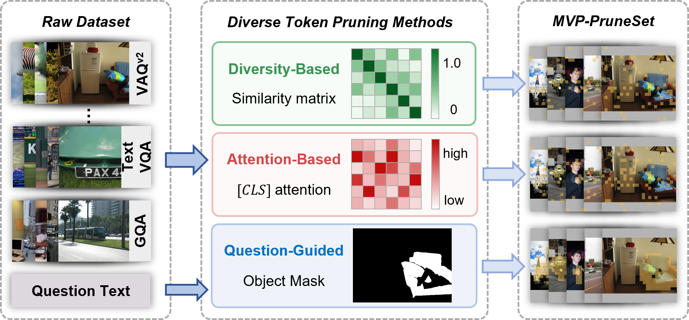
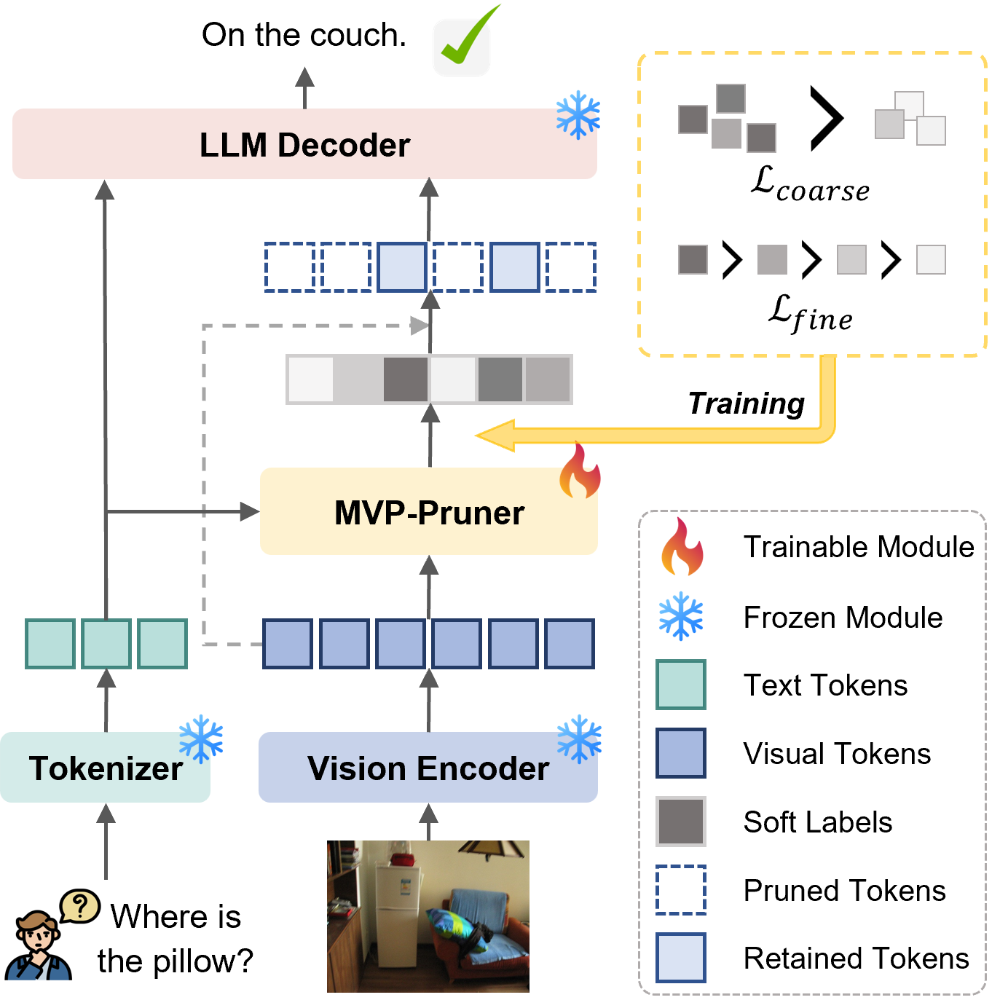

# MVP-Token

Minimal review package for MVP-Token visual token pruning.





## Requirements

Configure these dependencies before running the scripts:

- LLaVA-1.5-7B checkpoint
- lmms-eval checkout
- Qwen3-VL checkpoint
- SAM3 checkout/checkpoint

If LLaVA or lmms-eval are not placed inside this directory, pass their paths explicitly:

```bash
export LLAVA_REPO=/path/to/LLaVA
export LMMS_EVAL_REPO=/path/to/lmms-eval
```

## Entry Points

Build GRASP masks and dataset-side assets:

```bash
python mask_extraction/extractors/GRASP.py --help
```

Build SSF soft labels:

```bash
python mask_extraction/dataset_tools/SSF_label.py \
  --train_dir /path/to/train_data \
  --samples_json /path/to/train_data/sample_list.json
```

Train and evaluate MVP_Pruner:

```bash
python qvts/train.py \
  --samples-json /path/to/train_data/train_supervision/ssf_family_beta_soft_label_samples.json \
  --llava-path /path/to/llava-v1.5-7b

python qvts/run_lmms_eval.py \
  --tasks pope,gqa \
  --pretrained /path/to/llava-v1.5-7b \
  --adapter-ckpt outputs/mvp_pruner/checkpoints/best.pt \
  --lmms-eval-repo /path/to/lmms-eval \
  --llava-repo /path/to/LLaVA
```
